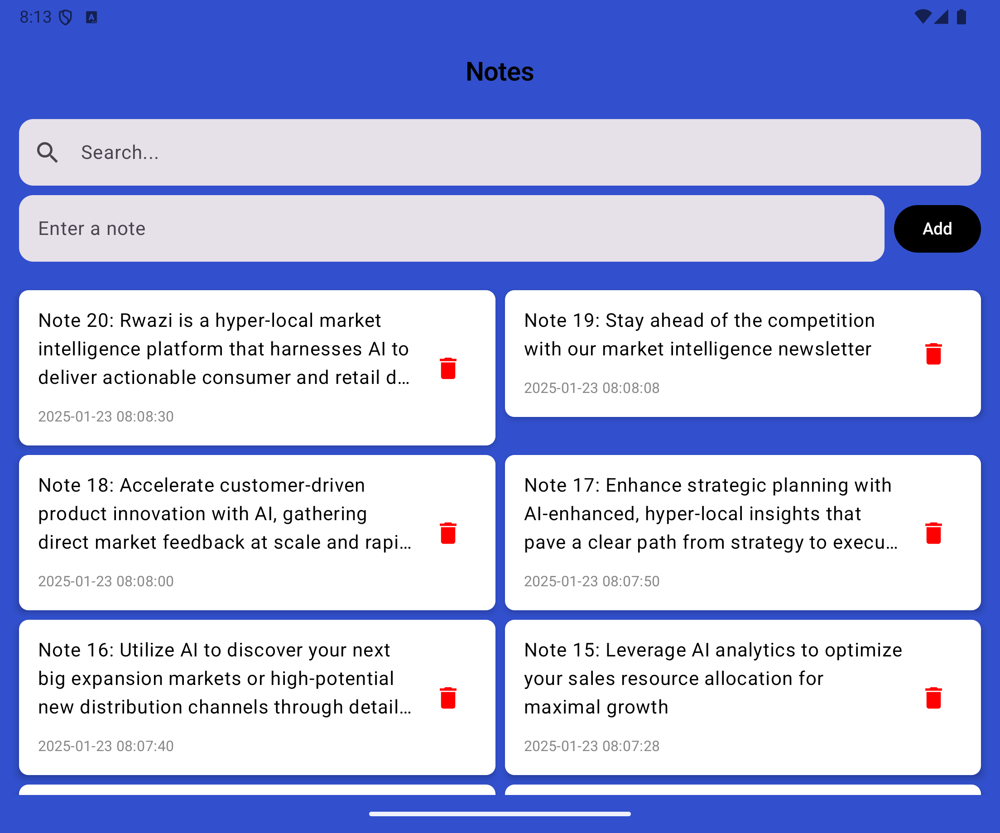

[](https://app.bitrise.io/app/823c9185-a83c-475e-9fac-2e2b5d582fa4)

# Notes

## Requirements

- Gradle JDK 17 (Settings | Build, Execution, Deployment | Build Tools | Gradle)
- Run the project in Android Studio, which supports Gradle 8.9.

## Configuration
- File: NoteConfig.kt
  - Notes per page: 10
  - App syncs to cloud every 30s
  - App syncs from the cloud the first time it is opened.

## Screenshots

| Notes on Small screen                             | Notes on Large Screen                                          |
|---------------------------------------------------|----------------------------------------------------------------|
|  |  |

## Testing

- Run unit testing with coverage:

```
$ ./gradlew koverHtmlReport
```

Report is located at: `app/build/reports/kover/html/index.html`


## Static code analysis

Report is located at: `./app/build/reports/lint/`

- Detekt

```
$ ./gradlew detekt
```

Report is located at: `./build/reports/detekt`

## Build and deploy

For `release` builds, we need to provide release keystore and signing properties:

- Put the `release.keystore` file at root `config` folder.
- Put keystore signing properties in `signing.properties`
